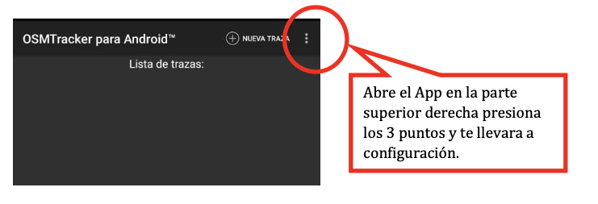
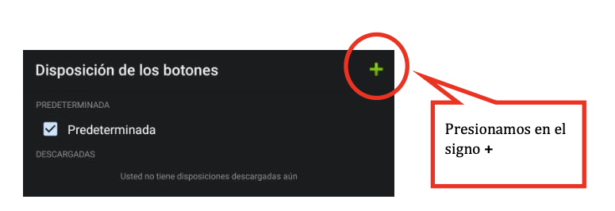
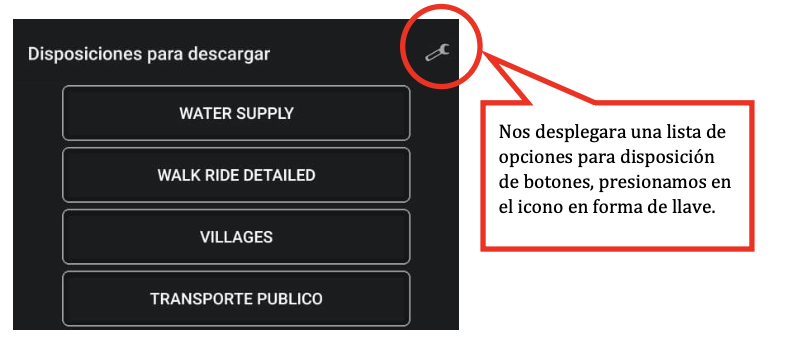
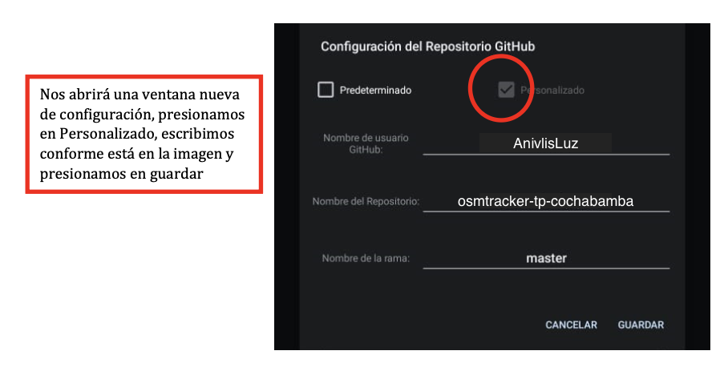
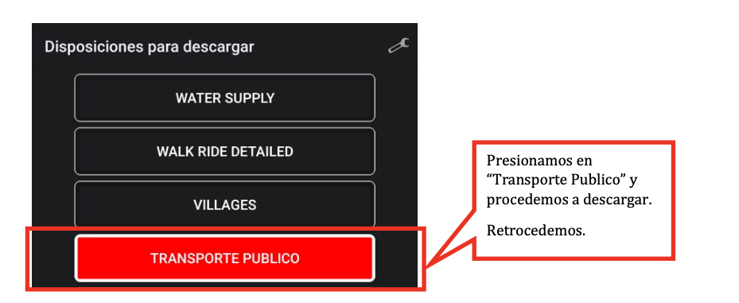
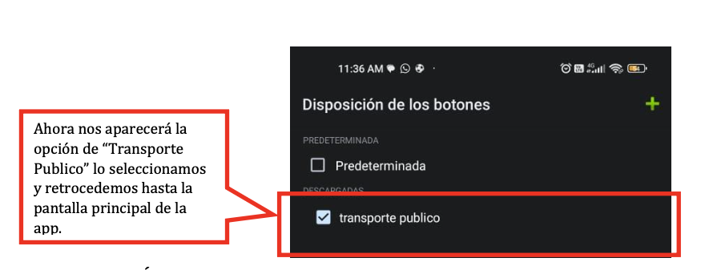

# OSMTracker – Transporte Público Cochabamba

Layout personalizado para OSMTracker orientado a la recolección de datos de rutas de transporte público urbano en Cochabamba, Bolivia. Los datos recolectados se exportan en formato GPX y se suben a [OpenStreetMap](https://www.openstreetmap.org/).

Basado en el trabajo de [Trufi Association e.V.](https://www.trufi-association.org/) para el proyecto OMUS Trujillo.

---

## Requisitos

- Dispositivo Android
- Cuenta en [OpenStreetMap](https://www.openstreetmap.org/user/new)
- (Opcional, para subir datos) Computadora con [JOSM](https://josm.openstreetmap.de/)

---

## 1. Instalación de OSMTracker

Instala OSMTracker desde Google Play Store o desde F-Droid:

- [Google Play Store](https://play.google.com/store/apps/details?id=net.osmtracker)
- [F-Droid](https://f-droid.org/es/packages/net.osmtracker/) *(recomendado si tu dispositivo no es compatible con Play Store)*

---

## 2. Configurar el layout de Transporte Público

### Paso 1 — Abrir la configuración

Abre OSMTracker. En la pantalla principal presiona el ícono de **⋮ (tres puntos)** en la esquina superior derecha y selecciona **Configuración**.

<!-- CAPTURA 1: Pantalla principal de OSMTracker con el menú de tres puntos abierto -->

---

### Paso 2 — Ir a "Disposición de los botones"

Dentro de Configuración, baja hasta encontrar la opción **Disposición de los botones** y presiónala.

<!-- CAPTURA 2: Pantalla de Configuración con la opción "Disposición de los botones" visible -->

---

### Paso 3 — Agregar nueva disposición

Presiona el ícono **+** en la esquina superior derecha para agregar una nueva disposición.

<!-- CAPTURA 3: Pantalla "Disposición de los botones" con el botón + visible -->

---

### Paso 4 — Configurar el repositorio

Se mostrará una lista de layouts disponibles. Presiona el **ícono de llave 🔧** en la esquina superior derecha para configurar un repositorio personalizado.

<!-- CAPTURA 4: Lista de layouts con el ícono de llave visible -->

Selecciona **Personalizado** e ingresa los siguientes datos:

| Campo                    | Valor                       |
| ------------------------ | --------------------------- |
| Nombre de usuario GitHub | `AnivlisLuz`                |
| Nombre del Repositorio   | `osmtracker-tp-cochabamba`  |
| Nombre de la rama        | `master`                    |

Presiona **Guardar**.

<!-- CAPTURA 5: Ventana de configuración del repositorio GitHub con los datos ingresados -->

---

### Paso 5 — Descargar el layout

En la lista de layouts aparecerá **TRANSPORTE PUBLICO**. Presiónalo para descargarlo y luego retrocede.

<!-- CAPTURA 6: Lista de layouts con "TRANSPORTE PUBLICO" visible y seleccionado -->

---

### Paso 6 — Activar el layout

De vuelta en **Disposición de los botones**, selecciona **transporte publico** como disposición activa.

<!-- CAPTURA 7: Pantalla "Disposición de los botones" con "transporte publico" activado (con tilde) -->

---

## 3. Uso en campo

### Iniciar una nueva grabación

Desde la pantalla principal de OSMTracker presiona **+ NUEVA TRAZA**.

<!-- CAPTURA 8: Pantalla de botones del layout con los 3 botones: Inicio de ruta, Fin de ruta, Parada -->

### Flujo de trabajo

1. **Al subir al vehículo** — presiona el botón de nota (ícono de texto) y escribe el nombre o número de la línea y el tipo de vehículo (Trufi / Micro / Minibús).
2. **Al iniciar el recorrido** — presiona **Inicio de ruta**.
3. **Al pasar por una parada** — presiona **Parada**.
4. **Al terminar el recorrido** — presiona **Fin de ruta**.
5. **Detener la grabación** — usa el botón de stop en la pantalla principal.

### Exportar los datos

Una vez terminada la grabación, desde la lista de trazas mantén presionada la traza y selecciona **Exportar como GPX**.

---

## 4. Subir datos a OpenStreetMap con JOSM

1. Descarga e instala [JOSM](https://josm.openstreetmap.de/).
2. Abre JOSM y ve a **Archivo → Abrir** para importar el archivo GPX.
3. Edita y completa la información siguiendo las [normas de etiquetado de OSM para transporte público](https://wiki.openstreetmap.org/wiki/ES:Transporte_p%C3%BAblico).
4. Conéctate a tu cuenta OSM desde JOSM y sube los cambios.

---

## Recursos

- [Wiki OSM – Transporte Público](https://wiki.openstreetmap.org/wiki/ES:Transporte_p%C3%BAblico)
- [Curso de mapeo de transporte público en OSM](https://mhub.com.co/enrol/index.php?id=21)
- [JOSM](https://josm.openstreetmap.de/)
- [Foros de OpenStreetMap](https://forum.openstreetmap.org/)
